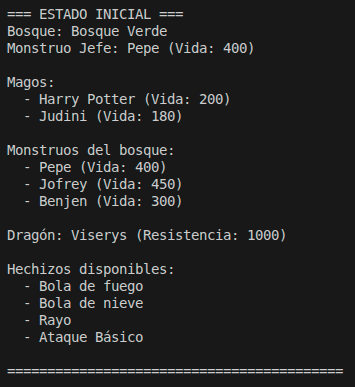
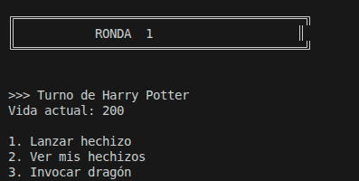
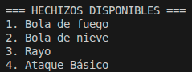
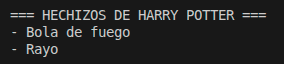
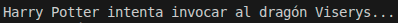
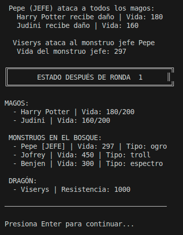

# MANUAL DE USUARIO
## ESTADO INICIAL

Estado inicial de la partida, se muestra el nombre del bosque, los hechizos disponibles en la partida y la vida de los distintos personajes con sus respectivos nombres y funciones.
## OPCIONES MAGO

En cada ronda tenemos 3 opciones con cada mago, la opción 2 que muestra los hechizos que el mago conoce no pasa turno, es decir, al usarla aún se puede jugar el turno con las otras 2 opciones, estas si que pasan turno.

### OPCIÓN 1

Muestra todos los hechizos disponibles en la partida, en caso de elegir un hechizo que el mago no conozca, este perderá 1 punto de vida.

### OPCIÓN 2

Esta opción muestra los hechizos conocidos por el mago.

### OPCIÓN 3

En esta opción el mago invoca al dragón del bosque, este aparecerá de forma aleatoria y en caso de éxito en la invocación, atacará al monstruo jefe.

## ATAQUE MONSTRUO

Después de que todos los magos realicen sus ataques, es el turno del monstruo jefe, este ataca a todos los magos vivos de la partida y después recibe un ataque del dragón.
Con esto finalizan todas las acciones de un turno y se muestra el estado actual de la partida. 
Presionando 'Enter' se pasa a la siguiente ronda. 

## FIN DE PARTIDA   
La partida finaliza cuando todos los mago mueran o cuando todos los monstruos mueran, siendo el equipo ganador el último en pie.

