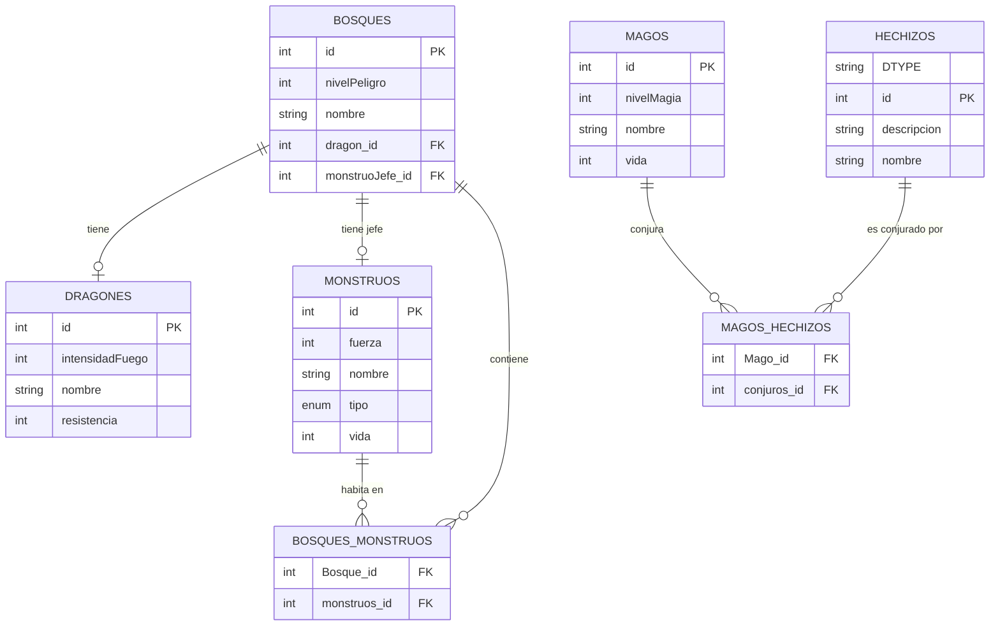

# DRAGOLANDIA

## INTRODUCIÓN
Dragolandia es un juego donde una serie de magos con la ayuda de un dragón lucha por el control de un bosque. Se trata de un jueog por turnos y el último en pie se queda con el control del bosque.

## ANÁLISIS

### DIAGRAMA DE CLASES

```mermaid
    classDiagram
        class Mago {
            -int id
            -string nombre
            -int vida
            -int nivelMagia
            -List~Hechizo~ conjuros
            +lanzarHechizo(Monstruo monstruo)
        }

    class Monstruo {
        -int id
        -string nombre
        -int vida
        -TipoMonstruo tipo
        -int fuerza
        +atacar(Mago mago)
    }

    class TipoMonstruo {
        <<enumeration>>
        OGRO
        TROLL
        ESPECTRO
    }

    class Dragon {
		-int id
        -string nombre
        -int intensidadFuego
        -int resistencia
        +exhalar(Monstruo monstruo)
    }

    class Bosque {
        -int id
        -string nombre
        -int nivelPeligro
        -Monstruo monstruoJefe
        -List~Monstruo~ monstruos
        +mostrarJefe()
        +cambiarJefe(Monstruo nuevoJefe)
        +addMonstruo(Monstruo monstruo)
    }

    class Hechizo {
        <<abstract>>
        -int id
        -String nombre
		-String descripción
        +efecto()*
    }

    class BolaFuego {
        +efecto()
    }

    class Rayo {

        +efecto()
    }

    class BolaNieve {
        +efecto()
    }

    class AtaqueBasico {
        +efecto()
    }

    Mago "1" --> "*" Hechizo : conoce
    Mago ..> Monstruo : lanza hechizo a
    Monstruo --> TipoMonstruo : tiene
    Monstruo ..> Mago : ataca a
    Dragon ..> Monstruo : exhala fuego a
    Dragon "1" --> "1" Bosque : habita en
    Bosque "1" --> "1" Monstruo : tiene jefe
    Bosque "1" --> "0..*" Monstruo : contiene
    Hechizo <|-- BolaFuego : hereda
    Hechizo <|-- Rayo : hereda
    Hechizo <|-- BolaNieve : hereda
    Hechizo <|-- AtaqueBasico : hereda
```

## DISEÑO

### ENTIDAD REALACIÓN

## CAMBIOS Y MEJORAS

El principal cambio que introduciría sería un sistema de maná para los magos. Es decir al invocar un hechizo gasta maná, y a su vez recupera una pequeña parte del total en cada turno.

## [MANUAL DE USUARIO](MANUAL.md)